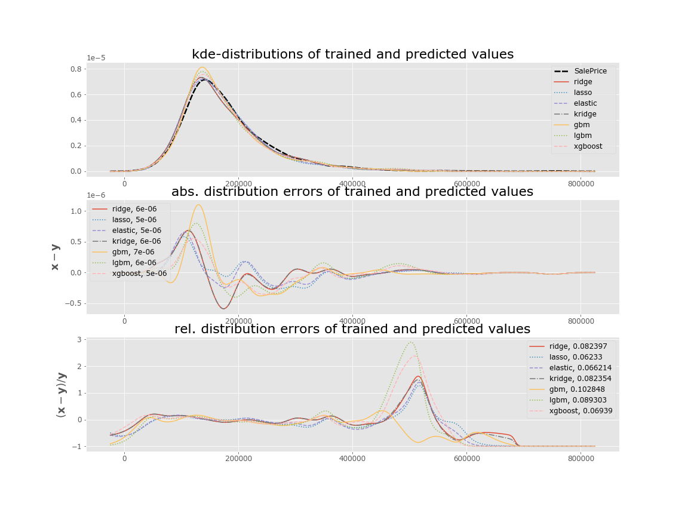
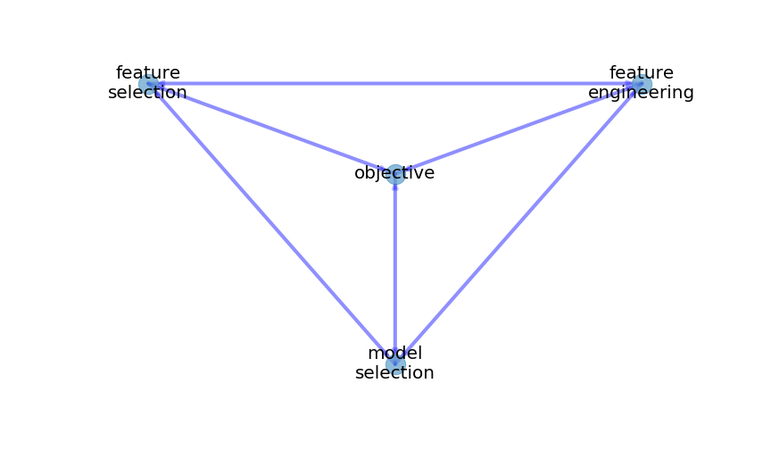

# Modeling protocol for supervised ML

A standardized protocol for modeling with supervised ML

## Goal: matching distributions

The overall goal is making a prediction given a new sample input; however to do this, the model must be able to recreate, _ie_ predict, the original distribution of the target feauture as well as necessary, _ie_ 
**what we want**: make a prediction  
**what we do**: match distributions

**Note** this is referred to in statistics as the Kullback-Leibler (or "KL") [divergence](https://en.wikipedia.org/wiki/Kullback%E2%80%93Leibler_divergence); it is used in ML-optimization within [cross-entropy minimization](https://en.wikipedia.org/wiki/Cross_entropy#Cross-entropy_minimization)

## Outline

0. Initial steps
    1. Get the problem
    2. Get the data
        * this might require going beyond the immediately available set
1. EDA (done!)
2. "Selection process"
3. Preparation
    1. Data prep
        * getting data ready for the model
    2. Model prep
        * getting the model ready for the data: parameter selection
4. Predict, Evaluate, Tune, Iterate (PETI)

## Exploratory Data Analysis

## "Selection process"

The selection process has four intrinsically inter-coupled topics:
* the **objective**: the question, prediction, classification
    * this is the "independent variable"
        * this has precedence and the others are meant to align with it
        * however, if the choice of the others fails, then perhaps the objective must be changed
* **feature selection**: which features get chosen
* **feature engineering**: changing the existing or creating new features
* **model selection**: the model(s) chosen to achieve the objective

**NOTE** this is usually automated (or automatable):
* there are methods to chose the best features from a set of data (_ie_ **feature selection**:);
    * there may still be a need for **feature engineering**
* Ensembles of Methods and voting achieve the **model selection**
    * **Note** The distinction here is "Ensembles of Methods" versus "Ensemble classifiers"
        * Ensembles of Methods: mixture of high-level methods/classifiers; e.g using a collection of XGBoost, Ridge- and Lasso- regressors
        * Ensemble classifiers: high-level methods composed of low-level (weak) classifiers; e.g. Random forrest (decision-tree) methods and Gradient-boosting methods 
    

## Preparation: input data and model
        
Once the selections have been made, the date must be prepared for ingetion, however, this has likely been done as part of the selection process.

The second part is choosing the best parameters for the model; this may be best achieved in the 'Tune' phase of the next section.

## Predict, Evaluate, Tune, Iterate (PETI)

## Appendix

### Pipelines

Pipelines are composed of steps, each of which has to be some kind of transformer 
* except the last step which can be a transformer or an estimator such as a machine learning model. 
transformers (see [sklearn.preprocessing](sklearn.preprocessing))
* Normalizer
* StandardScaler
* One Hot Encoder
**Note** any custom transformer should seamlessly integrate with my existing pipeline

When the dataset contains a mix of categorical and numerical (independent) variables, they will likely need to pre-processed in different ways and separately, and initially they’ll go through separate pipelines to be pre-processed appropriately and then later combined. 
* For both pipelines, extract the appropriate columns for pre-processing.